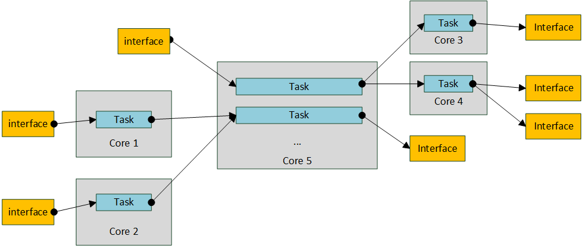
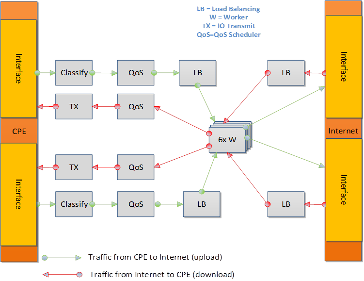

.. This work is licensed under a Creative Commons Attribution 4.0 International License.
.. http://creativecommons.org/licenses/by/4.0
.. (c) OPNFV, Intel Corporation and others.

.. OPNFV SAMPLEVNF Documentation design file.

==========================
SampleVNF Highlevel Design
==========================

The high level design of the VNF and common code is explained here.

Common Code - L2L3 stack
========================

Introduction
------------

L2L3 stack comprises of a set of libraries which are commonly used by all
other VNF's.

It comprises of following components.

  * Interface Manager
  * RTM Lock Library
  * ARP/ND & L2 adjacency Library
  * L3 stack components

Interface Manager
-----------------

Interface manager is a set of API's which acts as a wrapper for the physical
interfaces initialization & population. This set of api's assists in configuring
an ethernet device, setting up TX & RX queues & starting of the devices. It
provides various types of interfaces like L2 interface, IPv4/IPv6 interface.
It helps in Configuration (set/get) operations and status updates like (UP/DOWN)
from admin or operations. It provides Callback functions registration for other
components who wants to listen to interface status. It Maintains table of all
the interfaces present. It provides API for getting interface statistics.

It Provides wrapper APIs on top of DPDKs LAG(link Aggregation) APIs, This
includes creating/deleting BOND interfaces, knowing the properties like Bond
mode, xmit policy, link up delay, link monitor frequency.

RTM Lock Library
----------------

It provides basic lock & unlock functions which should be used for synchronization
purposes.

ARP/ND & L2 adjacency Library
-----------------------------

The ARP/ND state machine is given in the following diagram.

This library provides api's for handling ARP/ICMPv4 & ND/ICMPV6 packets
handling. It provides api's for creating/deleting & populating an entry.
It handles ARP request/response messages, Handles ICMP v4 echo request &
echo response messages. It handles ND solicitation/advertisement messages
for IPV6 packets. It Provide API for L2 Adjacency creation/deletion and
retrieval based on nexthop & port_id. It handles Gratuitous ARP.

::

  Basic commands for ARP/ND table
  p 1 arpls 0 (for ARP)
  p 1 arpls 1 (for ND)
  p 1 arpadd 0 <ip> <mac address> (for adding arp entry)
  p 1 arpdel 0 <ip>               (for deleting an arp entry)
  p 1 arpreq 0 <ip>               (for sending an arp request)

L3 stack Library
----------------

This library provides API for taking decision of whether pkt belongs to local
system or to forwarding.It Provides API for IPv4/IPv6 local packet out send
function. It Provides API for packet forwarding - LPM lookup function.

Common Code - Gateway routing
=============================

Introduction
------------

Gateway common code is created to support routing functionality for both
network and direct attached interfaces. It is supported for both IPv4 and
IPv6 routes.

The routeadd command is enhanced to support both net and host interfaces.
The net is used to define the gateway and host is used for direct
attached devices.

The routing tables are allocated per port basis limited for MAX_PORTS. The
number of route entries are supported upto 32 per interface. These sizes
can be changed at compile time based on the requirement. Memory is
allocated only for the nb_ports which is configured as per the VNF application
configuration.

Design
------

The next hop IP and Port numbers are retrieved from the routing table based on
the destinantion IP addreess. The destination IP address anded with mask is
looked in the routing table for the match. The port/interface number which
also stored as a part of the table entry is also retrieved.

The routing table will be added with entries when the routeadd CLI command is
executed through script or run time. There can be multiple routing entries per
interface/port.

The routeadd will report error if the match entry already exists or also if any
of parameters provide in the commands are not valied. Example the if port
number is bigger than the supported number ports/interface per application
configuration.

Reference routeadd command
--------------------------

Following are typical reference commands and syntax for adding routes using the CLI.

::

 ;routeadd <net/host> <port #> <ipv4 nhip address in decimal> <Mask/NotApplicable>
 routeadd net 0 202.16.100.20 0xffff0000
 routeadd net 1 172.16.40.20 0xffff0000
 routeadd host 0 202.16.100.20
 routeadd host 1 172.16.40.20

 ;routeadd <net/host> <port #> <ipv6 nhip address in hex> <Depth/NotApplicable>
 routeadd net 0 fec0::6a05:caff:fe30:21b0 64
 routeadd net 1 2012::6a05:caff:fe30:2081 64
 routeadd host 0 fec0::6a05:caff:fe30:21b0
 routeadd host 1 2012::6a05:caff:fe30:2081

vFW - Design
============

Requirements
------------

Following are the design requierments of the vFW.

-  The firewall will examine packets and verify that they are appropriate for the
   current state of the connection. Inappropriate packets will be discarded, and
   counter(s) incremented.
-  Support both IPv4 and IPv6 traffic type for TCP/UDP/ICMP.
-  All packet inspection features like firewall, synproxy, connection tracker
   in this component may be turned off or on through CLI commands
-  The Static filtering is done thorugh ACL using DPDK libraries. The rules
   can be added/modified through CLI commands.
-  Multiple instance of the vFW Pipeline running on multipe cores should be
   supported for scaling the performance scaling.
-  Should follow the DPDK IP pipeline framework
-  Should use the DPDK libraries and functionalities for better performance
-  The memory should be allocated in Hugepages using DPDK RTE calls for better
   performance.

High Level Design
-----------------

The Firewall performs basic filtering for malformed packets and dynamic packet
filtering incoming packets using the connection tracker library.
The connection data will be stored using a DPDK hash table. There will be one
entry in the hash table for each connection. The hash key will be based on
source address/port,destination address/port, and protocol of a packet. The
hash key will be processed to allow a single entry to be used, regardless of
which direction the packet is flowing (thus changing source and destination).
The ACL is implemented as libray stattically linked to vFW, which is used for
used for rule based packet filtering.

TCP connections and UDP pseudo connections will be tracked separately even if
theaddresses and ports are identical. Including the protocol in the hash key
will ensure this.

The Input FIFO contains all the incoming packets for vFW filtering.  The vFW
Filter has no dependency on which component has written to the Input FIFO.
Packets will be dequeued from the FIFO in bulk for processing by the vFW.
Packets will be enqueued to the output FIFO.

The software or hardware loadbalancing can be used for traffic distribution
across multiple worker threads. The hardware loadbalancing require ethernet
flow director support from hardware (eg. Fortville x710 NIC card).
The Input and Output FIFOs will be implemented using DPDK Ring Buffers.

Components of vFW
-----------------

In vFW, each component is constructed using packet framework pipelines.
It includes Rx and Tx Driver, Master pipeline, load balancer pipeline and
vfw worker pipeline components. A Pipeline framework is a collection of input
ports, table(s),output ports and actions (functions).

Receive and Transmit Driver
^^^^^^^^^^^^^^^^^^^^^^^^^^^
Packets will be received in bulk and provided to LoadBalancer(LB) thread.
Transimit takes packets from worker threads in a dedicated ring and sent to
hardware queue.

Master Pipeline
^^^^^^^^^^^^^^^
The Master component is part of all the IP Pipeline applications. This component
does not process any packets and should configure with Core 0, to allow
other cores for processing of the traffic. This component is responsible for
1. Initializing each component of the Pipeline application in different threads
2. Providing CLI shell for the user control/debug
3. Propagating the commands from user to the corresponding components

ARPICMP Pipeline
^^^^^^^^^^^^^^^^
This pipeline processes the APRICMP packets.

TXRX Pipelines
^^^^^^^^^^^^^^
The TXTX and RXRX pipelines are pass through pipelines to forward both ingress
and egress traffic to Loadbalancer. This is required when the Software
Loadbalancer is used.

Load Balancer Pipeline
^^^^^^^^^^^^^^^^^^^^^^
The vFW support both hardware and software balancing for load balancing of
traffic across multiple VNF threads. The Hardware load balancing require support
from hardware like Flow Director for steering of packets to application through
hardware queues.

The Software Load balancer is also supported if hardware load balancing can't be
used for any reason. The TXRX along with LOADB pipeline provides support for
software load balancing by distributing the flows to Multiple vFW worker
threads.
Loadbalancer (HW or SW) distributes traffic based on the 5 tuple (src addr, src
port, dest addr, dest port and protocol) applying an XOR logic distributing to
active worker threads, thereby maintaining an affinity of flows to worker
threads.

vFW Pipeline
^^^^^^^^^^^^
The vFW performs the basic packet filtering and will drop the invalid and
malformed packets.The Dynamic packet filtering done using the connection tracker
library. The packets are processed in bulk and Hash table is used to maintain
the connection details.
Every TCP/UDP packets are passed through connection tracker library for valid
connection. The ACL library integrated to firewall provide rule based filtering.

vCGNAPT - Design
================

Introduction
------------

This application implements vCGNAPT. The idea of vCGNAPT is to extend the life of
the service providers IPv4 network infrastructure and mitigate IPv4 address
exhaustion by using address and port translation in large scale. It processes the
traffic in both the directions.

It also supports the connectivity between the IPv6 access network to IPv4 data network
using the IPv6 to IPv4 address translation and vice versa.

Scope
-----

This application provides a standalone DPDK based high performance vCGNAPT
Virtual Network  Function implementation.

Features
--------

The vCGNAPT VNF currently supports the following functionality:
  • Static NAT
  • Dynamic NAT
  • Static NAPT
  • Dynamic NAPT
  • ARP (request, response, gratuitous)
  • ICMP (terminal echo, echo response, passthrough)
  • UDP, TCP and ICMP protocol passthrough
  • Multithread support
  • Multiple physical port support
  • Limiting max ports per client
  • Limiting max clients per public IP address
  • Live Session tracking to NAT flow
  • NAT64

High Level Design
-----------------

The Upstream path defines the traffic from Private to Public and the downstream
path defines the traffic from Public to Private. The vCGNAPT has same set of
components to process Upstream and Downstream traffic.

In vCGNAPT application, each component is constructed as IP Pipeline framework.
It includes Master pipeline component, load balancer pipeline component and vCGNAPT
pipeline component.

A Pipeline framework is collection of input ports, table(s), output ports and
actions (functions). In vCGNAPT pipeline, main sub components are the Inport function
handler, Table and Table function handler. vCGNAPT rules will be configured in the
table which translates egress and ingress traffic according to physical port
information from which side packet is arrived. The actions can be forwarding to the
output port (either egress or ingress) or to drop the packet.

vCGNAPT Background
------------------
The idea of vCGNAPT is to extend the life of the service providers IPv4 network infrastructure
and mitigate IPv4 address exhaustion by using address and port translation in large scale.
It processes the traffic in both the directions.

::

 +------------------+
 |      +-----+
 | Private consumer | CPE ----
 |   IPv4 traffic   +-----+  |
 +------------------+        |
          | +-------------------+             +------------------+
          | |      +------------+      -
          |-> -   Private IPv4   -   vCGNAPT  -      Public      -
          |-> -  access network  -    NAT44   -   IPv4 traffic   -
          | |      +------------+      -
          | +-------------------+             +------------------+
 +------------------+        |
 |      +-----+              |
 | Private consumer - CPE ----
 |   IPv4 traffic   +-----+
 +------------------+
      Figure: vCGNAPT deployment in Service provider network

Components of vCGNAPT
---------------------
In vCGNAPT, each component is constructed as a packet framework. It includes
Master pipeline component, driver, load balancer pipeline component and
vCGNAPT worker pipeline component. A pipeline framework is a collection of
input ports, table(s), output ports and actions (functions).

Receive and transmit driver
^^^^^^^^^^^^^^^^^^^^^^^^^^^
Packets will be received in bulk and provided to load balancer thread. The
transmit takes packets from worker thread in a dedicated ring and sent to the
hardware queue.

Master pipeline
^^^^^^^^^^^^^^^^
This component does not process any packets and should configure with Core 0,
to save cores for other components which processes traffic. The component
is responsible for:

 1. Initializing each component of the Pipeline application in different threads
 2. Providing CLI shell for the user
 3. Propagating the commands from user to the corresponding components.
 4. ARP and ICMP are handled here.

Load Balancer pipeline
^^^^^^^^^^^^^^^^^^^^^^^
Load balancer is part of the Multi-Threaded CGMAPT release which distributes
the flows to Multiple ACL worker threads.

Distributes traffic based on the 2 or 5 tuple (source address, source port,
destination  address, destination port and protocol) applying an XOR logic
distributing the  load to active worker threads, thereby maintaining an
affinity of flows to  worker threads.

Tuple can be modified/configured using configuration file

vCGNAPT - Static
------------------

The vCGNAPT component performs translation of private IP & port to public IP &
port at egress side and public IP & port to private IP & port at Ingress side
based on the NAT rules added to the pipeline Hash table. The NAT rules are
added to the Hash table via user commands. The packets that have a matching
egress key or ingress key in the NAT table will be processed to change IP &
port and will be forwarded to the output port. The packets that do not have a
match will be taken a default action. The default action may result in drop of
the packets.

vCGNAPT- Dynamic
-----------------

The vCGNAPT component performs translation of private IP & port to public IP &
port at egress side and public IP & port to private IP & port at Ingress side
based on the NAT rules added to the pipeline Hash table. Dynamic nature of
vCGNAPT refers to the addition of NAT entries in the Hash table dynamically
when new packet arrives. The NAT rules will be added to the Hash table
automatically when there is no matching entry in the table and the packet is
circulated through software queue. The packets that have a matching egress
key or ingress key in the NAT table will be processed to change IP &
port and will be forwarded to the output port defined in the entry.

Dynamic vCGNAPT acts as static one too, we can do NAT entries statically.
Static NAT entries port range must not conflict to dynamic NAT port range.

vCGNAPT Static Topology
----------------------

IXIA(Port 0)-->(Port 0)VNF(Port 1)-->(Port 1) IXIA
operation:
  Egress --> The packets sent out from ixia(port 0) will be CGNAPTed to ixia(port 1).
  Igress --> The packets sent out from ixia(port 1) will be CGNAPTed to ixia(port 0).

vCGNAPT Dynamic Topology (UDP_REPLAY)
-------------------------------------

IXIA(Port 0)-->(Port 0)VNF(Port 1)-->(Port 0)UDP_REPLAY
operation:
  Egress --> The packets sent out from ixia will be CGNAPTed to L3FWD/L4REPLAY.
  Ingress --> The L4REPLAY upon reception of packets (Private to Public Network),
                    will immediately replay back the traffic to IXIA interface. (Pub -->Priv).

How to run L4Replay
-------------------

After the installation of ISB on L4Replay server go to /opt/isb_bin and run the
following command.

::

 ./UDP_Replay -c  core_mask -n no_of_channels(let it be as 2) -- -p PORT_MASK --config="(port,queue,lcore)"
 eg: ./UDP_Replay -c 0xf -n 4 -- -p 0x3 --config="(0,0,1)"

vACL - Design
=============

Introduction
--------------
This application implements Access Control List (ACL). ACL is typically used
for rule based policy enforcement. It restricts access to a destination IP
address/port based on various header fields, such as source IP address/port,
destination IP address/port and protocol. It is built on top of DPDK and uses
the packet framework infrastructure.

Scope
------
This application provides a standalone DPDK based high performance ACL Virtual
Network Function implementation.

High Level Design
------------------
The ACL Filter performs bulk filtering of incoming packets based on rules in
current ruleset, discarding any packets not permitted by the rules. The
mechanisms needed for building the rule database and performing lookups are
provided by the DPDK API.

http://dpdk.org/doc/api/rte__acl_8h.html

The Input FIFO contains all the incoming packets for ACL filtering. Packets
will be dequeued from the FIFO in bulk for processing by the ACL. Packets will
be enqueued to the output FIFO.

The Input and Output FIFOs will be implemented using DPDK Ring Buffers.

The DPDK ACL example:

http://dpdk.org/doc/guides/sample_app_ug/l3_forward_access_ctrl.html

#figure-ipv4-acl-rule contains a suitable syntax and parser for ACL rules.

Components of ACL
------------------
In ACL, each component is constructed as a packet framework. It includes
Master pipeline component, driver, load balancer pipeline component and ACL
worker pipeline component. A pipeline framework is a collection of input ports,
table(s), output ports and actions (functions).

Receive and transmit driver
^^^^^^^^^^^^^^^^^^^^^^^^^^^
Packets will be received in bulk and provided to load balancer thread. The
transmit takes packets from worker thread in a dedicated ring and it is sent
to the hardware queue.

Master
^^^^^^
This component does not process any packets and should configure with Core 0,
to save cores for other components which processes traffic.

The component is responsible for

 1. Initializing each component of the Pipeline application in different threads
 2. Providing CLI shell for the user
 3. Propagating the commands from user to the corresponding components.
 4. ARP and ICMP are handled here.

Load Balancer
^^^^^^^^^^^^^

Load balancer is part of the Multi-Threaded ACL release which distributes
the flows to Multiple ACL worker threads.

Distributes traffic based on the 5 tuple (source address, source port, destination
address, destination port and protocol) applying an XOR logic distributing the
load to active worker threads, thereby maintaining an affinity of flows to
worker threads.

ACL Pipeline
^^^^^^^^^^^^

Visit the following link for DPDK ACL library implementation.

http://dpdk.org/doc/api/rte__acl_8h.html
http://dpdk.org/doc/guides/prog_guide/packet_classif_access_ctrl.html

Provides shadow copy for runtime rule configuration support

Implements policy based packet forwarding

vPE - Design
============

Introduction
------------

An Edge Router typically sits between two networks such as the provider core
network and the provider access network. In the below diagram, Customer Edge
(CE) Router sits in the provider access network and MPLS cloud network
represents the provide core network.
The edge router processes the traffic in both the directions. The functionality
of the Edge Router varies while processing each direction of traffic. The
packets to the core network will be filtered, classified and metered with QoS
parameters. The packets to the access network will be shaped according to the
subscription policy.
The idea of Edge Router application is to provide the benchmark for the
functionality of Provider Edge routers in each direction.

The DPDK IP Pipeline Framework provides set of libraries to build a pipeline
application. The Provider Edge Router functionality delivered as a virtual
network function (VNF) is integrated with DPDK, optimized for Intel hardware
architecture.
This document assumes the reader possess the knowledge of DPDK concepts and
IP Pipeline Framework. For more details, read DPDK Getting Started Guide, DPDK
Programmers Guide, DPDK Sample Applications Guide.

Scope
-----

This application provides a standalone DPDK based high performance Provide
Edge Router Network Function implementation.

High Level Design
-----------------

The Edge Router application processes the traffic between Customer and the core
network.
The Upstream path defines the traffic from Customer to Core and the downstream
path defines the traffic from Core to Customer. The Edge Router has different
set of components to process Upstream and Downstream traffic.

In Edge Router application, each component is constructed as building blocks in
IP Pipeline framework. As in Pipeline framework, each component has its own
input ports, table and output ports. The rules of the component will be
configured in the table which decides the path of the traffic and any action to
be performed on the traffic. The actions can be forwarding to the output port,
forwarding to the next table or drop. For more details, please refer Section 24
of DPDK Programmers Guide (3).

The Core-to-Customer traffic is mentioned as downstream. For downstream
processing, Edge Router has the following functionalities in Downstream

   ---> Packet Rx --> Routing --> Traffic Manager --> Packet Tx -->

  Routing
    To identify the route based on the destination IP.
    To provide QinQ label based on the destination IP.
  Encapsulation
    Updates the MAC address based on the route entry.
    Appends the QinQ label based on the route entry.
  Traffic Manager
    To perform QoS traffic management (5-level hierarchical scheduling) based on
    the predefined set of Service Level Agreements (SLAs)
    SVLAN, CVLAN, DSCP fields are used to determine transmission priority.
    Traffic Manager Profile which contains the SLA parameters are provided as
    part of the application.

The Customer-to-Core traffic is mentioned as upstream. For upstream processing,
Edge Router has the following functionalities in Upstream.

   ---> Packet Rx --> ACL filters --> Flow control --> Metering Policing &
   Marking --> Routing --> Queueing & Packet Tx -->

  Firewall
    To filter the unwanted packets based on the defined ACL rules.
    Source IP, Destination IP, Protocol, Source Port and Destination Port are
    used to derive the ACL rules.
    Flow Classification
    To classify the packet based on the QinQ label
    To assign a specific flow id based on the classification.
  Metering
    Two stages of QoS traffic metering and policing is applied.
    1st stage is performed per flow ID using trTCM algorithm
    2nd stage is performed per flow ID traffic class using trTCM algorithm
    Packets will be either dropped or marked Green, Yellow, Red based on the
    metering rules.
  Routing
    To identify the route based on the destination IP
    To provide MPLS label to the packets based on destination IP.
  Encapsulation
    Updates the MAC address based on the route entry.
    Appends the MPLS label based on the route entry.
    Update the packet color in MPLS EXP field in each MPLS header.

Components of vPE
-------------------

The vPE has downstream and upstream pipelines controlled by Master component.
Edge router processes two different types of traffic through pipelines
I.  Downstream (Core-to-Customer)
  1.  Receives TCP traffic from core
  2.  Routes the packet based on the routing rules
  3.  Performs traffic scheduling based on the traffic profile
    a.  Qos scheduling is performed using token bucket algorithm
        SVLAN, CVLAN, DSCP fields are used to determine transmission priority.
  4.  Appends QinQ label in each outgoing packet.
II. Upstream (Customer-to-Core)
  1.  Receives QinQ labelled TCP packets from Customer
  2.  Removes the QinQ label
  3.  Classifies the flow using QinQ label and apply Qos metering
    a.  1st stage Qos metering is performed with flow ID using trTCM algorithm
    b.  2nd stage Qos metering is performed with flow ID and traffic class using
    trTCM algorithm
    c.  traffic class maps to DSCP field in the packet.
  4.  Routes the packet based on the routing rules
  5.  Appends two MPLS labels in each outgoing packet.

Master Component
^^^^^^^^^^^^^^^^

The Master component is part of all the IP Pipeline applications. This
component does not process any packets and should configure with Core0,
to save cores for other components which processes traffic. The component
is responsible for
 1. Initializing each component of the Pipeline application in different threads
 2. Providing CLI shell for the user
 3. Propagating the commands from user to the corresponding components.

Upstream and Downstream Pipelines
^^^^^^^^^^^^^^^^^^^^^^^^^^^^^^^^^

The downstream will have Firewall, Pass-through, Metering and Routing pipelines.
The upstream will have Pass-through and Routing pipelines.

To run the VNF, execute the following:

::

 isb_root/VNFs/vPE$ ./build/ip_pipeline -p 0x3 \
   -f config/auto_combo_1_instances_1_queues_2_ports_v2.cfg \
   -s config/auto_combo_1_instances_1_queues_2_ports_v2.txt

Prox - Packet pROcessing eXecution engine
==========================================

Introduction
------------

Packet pROcessing eXecution Engine (PROX) which is a DPDK application.
PROX can do operations on packets in a highly configurable manner.
The PROX application is also displaying performance statistics that can
be used for performance investigations.
Intel® DPPD - PROX is an application built on top of DPDK which allows creating
software architectures, such as the one depicted below, through small and readable
configuration files.

The figure shows that each core is executing a set of tasks. Currently,
a task can be any one of the following:

1. Classify
2. Drop
3. Basic Forwarding (no touch)
4. L2 Forwarding (change MAC)
5. GRE encap/decap
6. Load balance based on packet fields
7. Symmetric load balancing
8. QinQ encap/decap IPv4/IPv6
9. ARP
10. QoS
11. Routing
12. Unmpls
13. Policing
14. ACL ...

One of the example configurations that is distributed with the source code is a
Proof of Concept (PoC) implementation of a Broadband Network Gateway (BNG)
with Quality of Service (QoS).
The software architecture for this PoC is presented below.

The display shows per task statistics through an ncurses interface.
Statistics include: estimated idleness; per second statistics for packets
received, transmitted or dropped; per core cache occupancy; cycles per packet.
These statistics can help pinpoint bottlenecks in the system.
This information can then be used to optimize the configuration.
Other features include debugging support, scripting,
Open vSwitch support... A screenshot of the display is provided below.

