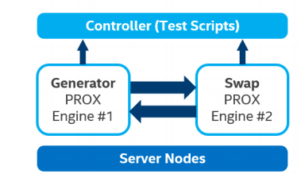

.. This work is licensed under a Creative Commons Attribution 4.0 International
.. License.
.. http://creativecommons.org/licenses/by/4.0
.. (c) OPNFV, Intel Corporation and others.

SampleVNF Installation
======================

Abstract
--------
The installation procedures described below will result in the deployment of
all SW components needed to run the benchmarking procedures as defined in ETSI
GS NFV-TST009 on top of an NFVI instance that is the subject of this characterization.
Xtesting in combination with the rapid scripts and the PROX tool will be used to achieve this.

The steps needed to run the benchmarking are:
  1) Identify a machine on which you will install the containers to support the testing
  2) Clone the samplevnf project on that machine
  3) Deploy the testing VMs (hosting PROX tool) (Or containers)
  4) Deploy your own Xtesting toolchain.
  5) Build the test container that will drive the TST009 testing
  6) Publish your container on your local repository
  7) Execute the testing

In this chapter, we will cover the first 6 installation steps.

Prerequisites
-------------

Supported Test setup
^^^^^^^^^^^^^^^^^^^^^
The device under test (DUT) is an NFVI instance on which we can deploy PROX instances.
A PROX instance is a machine that
  * has a management interface that can be reached from the test container
  * has one or more data plane interfaces on a dataplane network.
  * can be a container, a VM or a bare metal machine. We just need to be able to ssh into the
    PROX machine from the test container.
  * is optimized for data plane traffic.
  * will measure the throughput that is offered through its dataplane interface(s)
There are no requirements on the NFVI instance itself. Of course, the measured throughput will
depend heavily on the NFVI characteristics.
In this release, we are supporting an automated deployment of the PROX instance on an NFVI that
provides the OpenStack Heat interface. You could also deploy the PROX instances using other
mechanisms. As long as you provide the necessary files describing these instances, the execution
of the test can also be done automatically (steps 4-7) and hence be executed on different DUTs,
e.g. VMWare, K8s, bare metal, ...

Below is the basic picture of the deployment needed for the testing.

Different test scenario's can now be executed by deploying the PROX machines on different systems:
  * The generator machine could be deployed on a well defined compute node, that has network access
    to the other nodes through the TOR. The generated traffic is very similar to external traffic.
  * The Generator and the Swap instance could be on the same compute node to test E-W traffic between
    2 instance on the same compute node
  * The Generator and the Swap instance could be on a different compute node

Many VMs can be deployed before the test is running: each test case can then use different pairs of
PROX instances to test all the above scenarios

Hardware & Software Ingredients
^^^^^^^^^^^^^^^^^^^^^^^^^^^^^^^

The only requirement is to have the PROX instances running. There are no stringent requirements to be able
to run the test. Of course, the dataplane performance will heavily depend on the underlying NFVI HW & SW

Installation Steps
------------------

Step 1: Identify a machine on which you will install the containers
^^^^^^^^^^^^^^^^^^^^^^^^^^^^^^^^^^^^^^^^^^^^^^^^^^^^^^^^^^^^^^^^^^^
This machine will needs enough resource to install the Xtesting framework and needs to be enabled
for containers.
From a network point of view, it will need to have access to the PROX instances: That means it will need
to be able to ssh into these machines and that the network also needs to allow for TCP port 8474 traffic.

When using the automation to create the VM through the Heat Stack API, this machine also needs to be able
execute the OpenStack API. Alternatively, the creation of the VMs can be executed on another machine, but
this will involve some manual file copying.

Step 2: Clone the samplevnf project on that machine
^^^^^^^^^^^^^^^^^^^^^^^^^^^^^^^^^^^^^^^^^^^^^^^^^^^

.. code-block:: console

     git clone https://git.opnfv.org/samplevnf

Go to the relevant directory in this repository: samplevnf/VNFs/DPPD-PROX/helper-scripts/rapid/

Step 3: Deploy the testing VMs
^^^^^^^^^^^^^^^^^^^^^^^^^^^^^^
In this step, we will be deploying 2 or more instances that host the PROX tool. At the end of this step,
the instances will be running and an environment file (default name: rapid.env) will be created. This file
will have all information needed to run the actual test. You can do this step manually on all kinds of
platforms (OpenStack, VMWare, K8s, bare metal, ...), but the automation tools described in the rest of this
paragraph will using OpenStack Heat yaml files.
First, a PROX qcow2 image needs to be downloaded.

.. code-block:: console

     wget http://artifacts.opnfv.org/samplevnf/jerma/prox_jerma.qcow2

This image can also be created mannualy by following instructions in https://wiki.opnfv.org/display/SAM/Rapid+scripting,
in the section "Creating an image" 
Now upload this image to Openstack:

.. code-block:: console

     openstack image` create  --disk-format qcow2 --container-format bare --file prox_jerma.qcow2 rapidVM

Now run createrapid.sh to create the stack. This process takes the config_file as input. Details can be found in
https://wiki.opnfv.org/display/SAM/Rapid+scripting, in the section "Deploying the VMs"

.. code-block:: console

     ./createrapid.sh

At the end of this step, VMs should be running and the rapid.env and rapid_key.pem files should be available.

Step 4: Deploy your own Xtesting toolchain
^^^^^^^^^^^^^^^^^^^^^^^^^^^^^^^^^^^^^^^^^^
Install Xtesting as described in https://xtesting.readthedocs.io/en/latest/
First goto the xtesting directory in samplevnf/VNFs/DPPD-PROX/helper-scripts/rapid/xtesting (this was cloned
in step 2)

.. code-block:: console

     virtualenv xtesting
     . xtesting/bin/activate
     pip install ansible
     ansible-galaxy install collivier.xtesting
     ansible-playbook site.yaml
     deactivate
     rm -r xtesting

Step 5: Build the test container that will drive the TST009 testing
^^^^^^^^^^^^^^^^^^^^^^^^^^^^^^^^^^^^^^^^^^^^^^^^^^^^^^^^^^^^^^^^^^^
Go to the directory samplevnf/VNFs/DPPD-PROX/helper-scripts/rapid/xtesting
While building this container, some files will be copied into the container image. Two of these files
are generated by Step 3: rapid.env and rapid_key.pem and reside in the samplevnf/VNFs/DPPD-PROX/helper-scripts/rapid/.
Please copy them into the xtesting directory.
The 3rd file that will be copied is testcases.yaml. You might want to modify this file according to the testing you would 
like to execute.

.. code-block:: console

     docker build -t 127.0.0.1:5000/rapidxt .

Step 6: Publish your container on your local repository
^^^^^^^^^^^^^^^^^^^^^^^^^^^^^^^^^^^^^^^^^^^^^^^^^^^^^^^

.. code-block:: console

     docker push  127.0.0.1:5000/rapidxt

You are now ready to execute the testing
