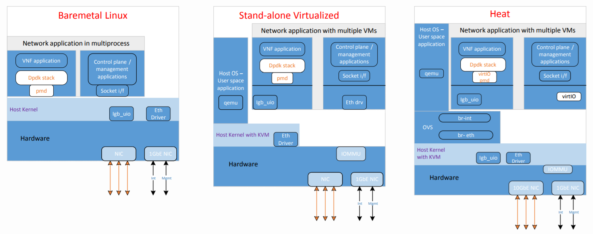

.. This work is licensed under a Creative Commons Attribution 4.0 International
.. License.
.. http://creativecommons.org/licenses/by/4.0
.. (c) OPNFV, Intel Corporation and others.

SampleVNF Installation
======================

Abstract
--------

This project provides a placeholder for various sample VNF
(Virtual Network Function (:term:`VNF`)) development which includes example
reference architecture and optimization methods related to VNF/Network service
for high performance VNFs.
The sample VNFs are Open Source approximations* of Telco grade VNF’s using
optimized VNF + NFVi Infrastructure libraries, with Performance Characterization
of Sample† Traffic Flows.

::

  * Not a commercial product. Encourage the community to contribute and close the feature gaps.
  † No Vendor/Proprietary Workloads

SampleVNF supports installation directly in Ubuntu. The installation procedure
are detailed in the sections below.

The steps needed to run SampleVNF are:
  1) Install and Build SampleVNF.
  2) Deploy the VNF on the target and modify the config based on the Network under test
  3) Run the traffic generator to generate the traffic.

Prerequisites
-------------

Supported Test setup
^^^^^^^^^^^^^^^^^^^^^
The device under test (DUT) consists of a system following;
  * A single or dual processor and PCH chip, except for System on Chip (SoC) cases
  * DRAM memory size and frequency (normally single DIMM per channel)
  * Specific Intel Network Interface Cards (NICs)
  * BIOS settings noting those that updated from the basic settings
  * DPDK build configuration settings, and commands used for tests
Connected to the DUT is an IXIA* or Software Traffic generator like pktgen or TRex,
simulation platform to generate packet traffic to the DUT ports and
determine the throughput/latency at the tester side.

Below are the supported/tested (:term:`VNF`) deployment type.

Hardware & Software Ingredients
^^^^^^^^^^^^^^^^^^^^^^^^^^^^^^^

SUT requirements:

::

   +-----------+------------------+
   | Item      | Description      |
   +-----------+------------------+
   | Memory    | Min 20GB         |
   +-----------+------------------+
   | NICs      | 2 x 10G          |
   +-----------+------------------+
   | OS        | Ubuntu 16.04 LTS |
   +-----------+------------------+
   | kernel    |  4.4.0-34-generic|
   +-----------+------------------+
   | DPDK      | 17.02            |
   +-----------+------------------+

Boot and BIOS settings:

::

   +------------------+---------------------------------------------------+
   | Boot settings    | default_hugepagesz=1G hugepagesz=1G hugepages=16  |
   |                  | hugepagesz=2M hugepages=2048 isolcpus=1-11,22-33  |
   |                  | nohz_full=1-11,22-33 rcu_nocbs=1-11,22-33         |
   |                  | Note: nohz_full and rcu_nocbs is to disable Linux*|
   |                  | kernel interrupts, and it’s import                |
   +------------------+---------------------------------------------------+
   |BIOS              | CPU Power and Performance Policy <Performance>    |
   |                  | CPU C-state Disabled                              |
   |                  | CPU P-state Disabled                              |
   |                  | Enhanced Intel® Speedstep® Tech Disabled          |
   |                  | Hyper-Threading Technology (If supported) Enable  |
   |                  | Virtualization Techology Enable                   |
   |                  | Coherency Enable                                  |
   |                  | Turbo Boost Disabled                              |
   +------------------+---------------------------------------------------+

Network Topology for testing VNFs
---------------------------------
The ethernet cables should be connected between traffic generator and the VNF server (BM,
SRIOV or OVS) setup based on the test profile.

The connectivity could be

1) Single port pair : One pair ports used for traffic

::

     e.g. Single port pair link0 and link1 of VNF are used
     TG:port 0 <------> VNF:Port 0
     TG:port 1 <------> VNF:Port 1

     For correalted traffic, use below configuration
     TG_1:port 0 <------> VNF:Port 0
                        VNF:Port 1 <------> TG_2:port 0 (UDP Replay)
     (TG_2(UDP_Replay) reflects all the traffic on the given port)

2) Multi port pair :  More than one pair of traffic

::

     e.g. Two port pair link 0, link1, link2 and link3 of VNF are used
     TG:port 0 <------> VNF:Port 0
     TG:port 1 <------> VNF:Port 1
     TG:port 2 <------> VNF:Port 2
     TG:port 3 <------> VNF:Port 3

     For correalted traffic, use below configuration
     TG_1:port 0 <------> VNF:Port 0
                          VNF:Port 1 <------> TG_2:port 0 (UDP Replay)
     TG_1:port 1 <------> VNF:Port 2
                          VNF:Port 3 <------> TG_2:port 1 (UDP Replay)
     (TG_2(UDP_Replay) reflects all the traffic on the given port)

* Bare-Metal
   Refer: http://fast.dpdk.org/doc/pdf-guides/ to setup the DUT for VNF to run

* Standalone Virtualization - PHY-VM-PHY
   * SRIOV
     Refer below link to setup sriov
     https://software.intel.com/en-us/articles/using-sr-iov-to-share-an-ethernet-port-among-multiple-vms

 * OVS_DPDK
     Refer below link to setup ovs-dpdk
     http://docs.openvswitch.org/en/latest/intro/install/general/
     http://docs.openvswitch.org/en/latest/intro/install/dpdk/

 * Openstack
     Use any OPNFV installer to deploy the openstack.

Build VNFs on the DUT:
----------------------

1) Clone sampleVNF project repository  - git clone https://git.opnfv.org/samplevnf

Auto Build - Using script to build VNFs
^^^^^^^^^^^^^^^^^^^^^^^^^^^^^^^^^^^^^^^
     * Interactive options:
       ::

         ./tools/vnf_build.sh -i
         Follow the steps in the screen from option [1] –> [10] and
         select option [9] to build the vnfs.
         It will automatically download selected DPDK version and any
         required patches and will setup everything and build VNFs.

         Options [8], If RestAPI feature is needed install 'civetweb'

         Following are the options for setup:
         ----------------------------------------------------------
         Step 1: Environment setup.
         ----------------------------------------------------------
         [1] Check OS and network connection
         [2] Select DPDK RTE version

         ----------------------------------------------------------
         Step 2: Download and Install
         ----------------------------------------------------------
         [3] Agree to download
         [4] Download packages
         [5] Download DPDK zip
         [6] Build and Install DPDK
         [7] Setup hugepages
         [8] Download and Build civetweb

         ----------------------------------------------------------
         Step 3: Build VNFs
         ----------------------------------------------------------
         [9] Build all VNFs (vACL, vCGNAPT, vFW, UDP_Replay, DPPD-PROX)

         [10] Exit Script

     * non-Interactive options:
       ::
         ./tools/vnf_build.sh -s -d=<dpdk version eg 17.02>

Manual Build
^^^^^^^^^^^^

   ::

      1. Download DPDK supported version from dpdk.org
         * http://dpdk.org/browse/dpdk/snapshot/dpdk-$DPDK_RTE_VER.zip
         * unzip dpdk-$DPDK_RTE_VER.zip and apply dpdk patches only in case of 16.04 (Not required for other DPDK versions)
         * cd dpdk
         * make config T=x86_64-native-linuxapp-gcc O=x86_64-native-linuxapp-gcc
         * cd x86_64-native-linuxapp-gcc
         * make -j
      2. Add this to Go to /etc/default/grub configuration file to setup hugepages.
         * Append “default_hugepagesz=1G hugepagesz=1G hugepages=8 hugepagesz=2M hugepages=2048” to the GRUB_CMDLINE_LINUX entry.
      3. Setup Environment Variable
         * export RTE_SDK=<samplevnf>/dpdk
         * export RTE_TARGET=x86_64-native-linuxapp-gcc
         * export VNF_CORE=<samplevnf> or using ./tools/setenv.sh
      4. Build SampleVNFs e.g, vACL
         * cd <samplevnf>/VNFs/vACL
         * make clean
         * make
         * The vACL executable will be created at the following location
           <samplevnf>/VNFs/vACL/build/vACL

2) Standalone virtualization/Openstack:

   Build VM image from script in  yardstick
   ::
     1) git clone https://git.opnfv.org/samplevnf
     2) cd samplevnf and run
        ./tools/samplevnf-img-dpdk-samplevnf-modify tools/ubuntu-server-cloudimg-samplevnf-modify.sh
        Image available in: /tmp/workspace/samplevnf/xenial-server-cloudimg-amd64-disk1.img

To run VNFs. Please refer chapter `05-How_to_run_SampleVNFs.rst`
